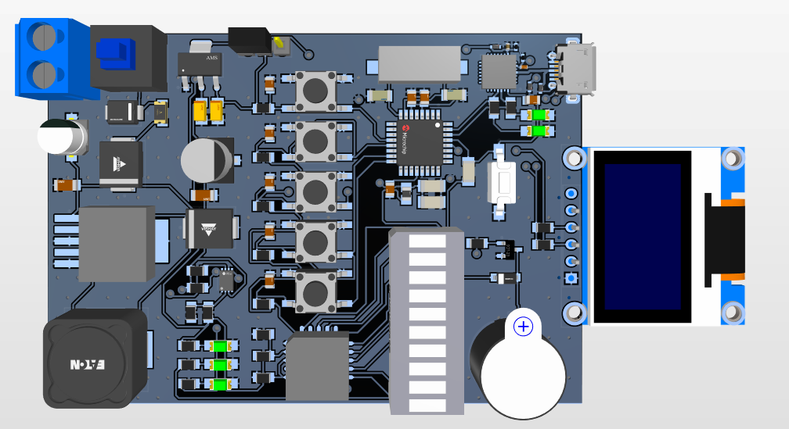
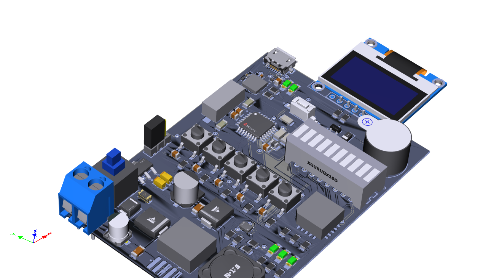
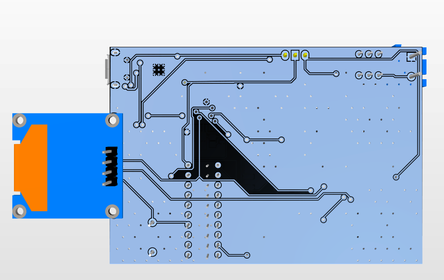
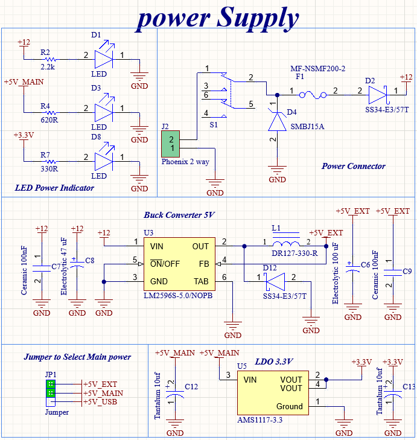
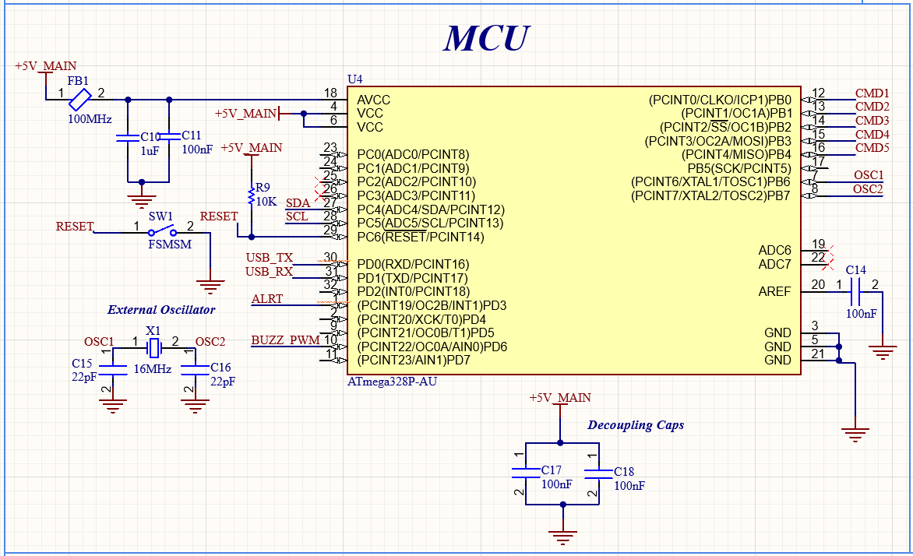
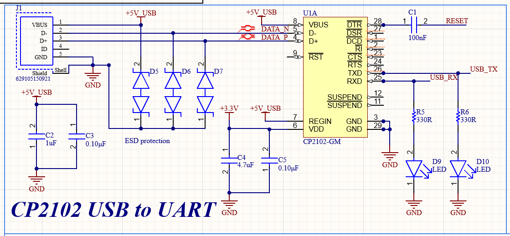
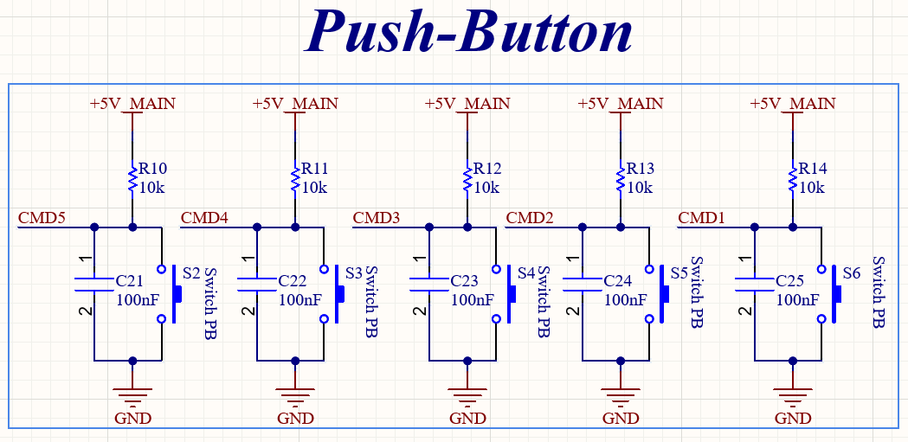
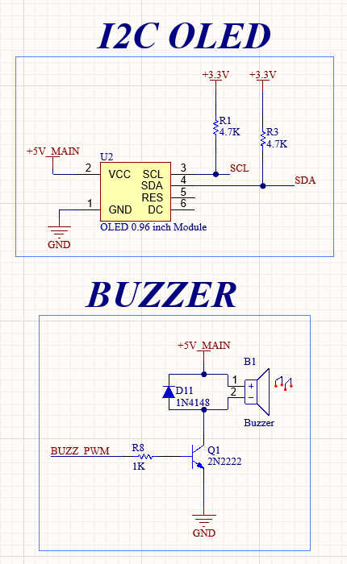
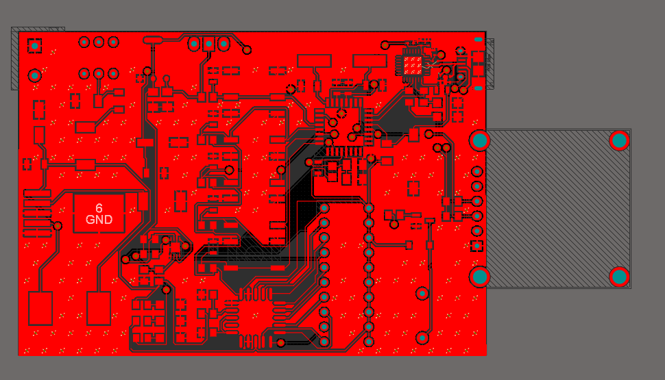
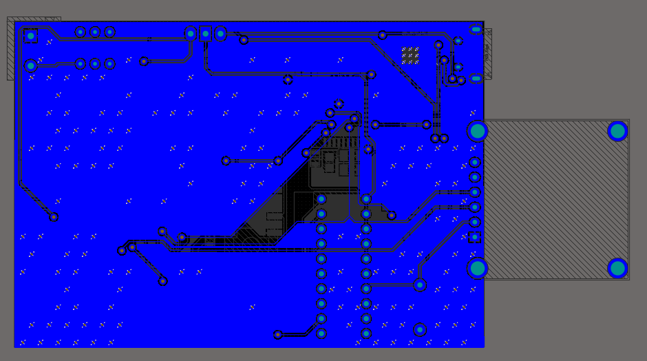

# Robot Shield – ATmega328P Controller

A compact, open-source **robot controller shield** designed around the **ATmega328P** microcontroller.  
This board integrates robust power protection, dual battery monitoring, multiple user interfaces, and plug-and-play Arduino IDE compatibility.

---

## 🚀 Board Renders

| **Top View** | **Isometric View** | **Bottom View** |
|:---:|:---:|:---:|
|  |  |  |

---

## 📋 Table of Contents
- [Features & Specifications](#-features--specifications)
- [Schematics](#-schematics)
- [PCB Layout](#-pcb-layout)
- [File Structure](#-file-structure)
- [License](#-license)

---

## ✨ Features & Specifications

| Feature | Description |
|:---|:---|
| **Microcontroller** | ATmega328P running at **16 MHz** |
| **Programming Interface** | CP2102 USB-to-UART with **Auto-Reset** |
| **Input Protection** | PTC Resettable Fuse, TVS Diode, Reverse Polarity Protection |
| **Power Supply** | 12 V input → 5 V (Buck Converter) + 3.3 V (LDO) |
| **Battery Monitoring** | **LM3914** LED bar graph + **MAX17043** digital fuel gauge (I²C) |
| **User Input** | 5 push-buttons with hardware debounce |
| **User Output** | 0.96" I²C OLED, buzzer with transistor driver |
| **Dimensions** | 60 mm × 80 mm |

---

## 📐 Schematics

| **Power** | **MCU** | **USB-to-UART (CP2102)** |
|:---:|:---:|:---:|
|  |  |  |

| **Push Buttons** | **OLED & Buzzer** | **Battery Fuel Gauge** |
|:---:|:---:|:---:|
|  |  |  |

---

## 🖥 PCB Layout

| **Top Layer** | **Bottom Layer** |
|:---:|:---:|
|  |  |

---

## 📂 File Structure
/Altium_Project
├── .PrjPcb # Main Altium project file
├── *.SchDoc # Schematic files
├── *.PcbDoc # PCB layout file
/Images
├── *.png # All images used in README
LICENSE
README.md
